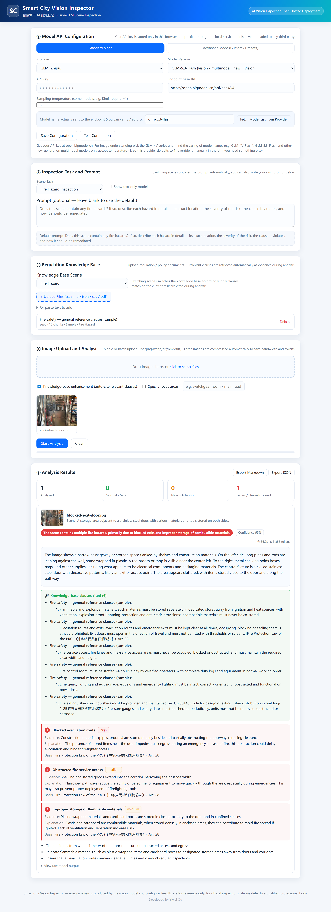

<div align="center">

# Smart City Vision Inspector

**Point a vision LLM at a street photo and get a hazard report that cites the
regulation it violates, together with a remediation plan.**

[](LICENSE)
[](https://github.com/YiweiOu/smartcity-vision-inspector/actions/workflows/ci.yml)
[](https://nodejs.org)
[](CONTRIBUTING.md)

English · [简体中文](README.zh-CN.md)

</div>

---

## Motivation

Municipal inspection teams collect far more imagery than they can review by hand.
Object detection helps, but a detection result such as "fire extinguisher,
confidence 0.94" is not something an operations team can act on. Three questions
remain open:

| Question | Why it matters | How this project addresses it |
|---|---|---|
| Which regulation does the finding violate? | Without a clause reference the finding cannot be enforced or audited | A server-side knowledge base is retrieved for each image, and every finding is annotated with the matching clause |
| What should be done about it? | Field staff need an action, not a label | Each finding carries concrete remediation steps |
| Is the result trustworthy, and what does it cost? | Model output varies between runs and providers; token cost is a real operating constraint | The risk level is computed server-side from structured severity values, and each run reports latency and token usage |

## Output of a single analysis

Uploading one photo returns:

- a **scene description** and an overall analysis written in Markdown;
- a list of **findings**, each with `type`, `severity` (`high`, `medium` or `low`),
  `evidence` (what was observed in the image), `explanation` (why it constitutes a
  risk) and `regulation` (the clause it violates);
- a **verdict** and a **remediation plan**;
- a **risk level** computed on the server from the structured severity values,
  independent of the model's own wording;
- the **latency and token usage** of the run, so that model choices can be compared
  on measured data;
- export of the full report as **Markdown or structured JSON**.

The analysis is produced by a vision LLM configured by the user: GLM-4V, Kimi,
Qwen-VL, Hunyuan, DeepSeek, GPT-4o, or any service implementing the
OpenAI-compatible `/v1/chat/completions` protocol.



## Sample output

The following is the platform's actual response for
[`samples/images/fire/blocked-exit-door.jpg`](samples/images/fire/blocked-exit-door.jpg),
produced with knowledge-enhanced analysis on `qwen-vl-max`:

```text
Scene     A storage area beside a stainless steel exit door, materials stored
          along both sides of the passage.
Risk      HIGH   (computed server-side from the findings' severities)

Finding 1   Blocked evacuation route                        severity: high
  evidence    Materials are stored directly beside and partially obstructing
              the doorway, reducing clearance.
  why         Stored items near the door impede quick egress in an emergency.
  cited       Fire Protection Law of the PRC (《中华人民共和国消防法》), Art. 28

Finding 2   Obstructed fire service access                  severity: medium
  cited       Fire Protection Law of the PRC (《中华人民共和国消防法》), Art. 28

Finding 3   Improper storage of flammable materials         severity: medium
  cited       Fire Protection Law of the PRC (《中华人民共和国消防法》), Art. 28

Verdict    Multiple fire hazards, primarily blocked exits and improper storage
           of combustible materials.

Remediation  1. Clear all items within 1 m of the door to restore egress.
             2. Relocate flammable materials to designated storage areas.
             3. Keep evacuation routes clear; inspect regularly.

Confidence 0.95 · 36.0 s · 3,856 tokens
```

Five further reports are included in [`samples/outputs/`](samples/outputs/):
extinguishers blocked by a pallet, a fire alarm control panel, two cases of
sidewalk parking, and an aerial view of street vending. Each is provided as JSON
(the raw API response, including token usage and the retrieved clauses) and as
formatted Markdown.

## Features

### Model selection

The standard mode ships presets for GLM (Zhipu), Kimi (Moonshot), Tencent Hunyuan,
Alibaba Qwen, DeepSeek and generic OpenAI-compatible gateways. The advanced mode
accepts any `baseURL` and model id, with a vision-capability flag and a temperature
setting. The model-list button queries the provider with the configured key and
lists the models the account can currently access.

### Regulation knowledge base

Regulation documents (`.txt`, `.md`, `.json`, `.csv`, `.pdf`) are uploaded through
the UI, chunked on the server, and scored by overlapping Chinese bigrams and
English tokens. In knowledge-enhanced mode the analysis runs in two stages: the
model first names the scene and produces 8 to 15 domain keywords, those keywords
drive retrieval, and the highest-scoring clauses are injected into the prompt used
for the final judgement. The clause citations in the sample above are the direct
result of this step.

### Scene profiles

Four scene profiles are provided by default: fire hazard, security monitoring,
traffic order and public-order patrol. Each defines a default prompt, a keyword set
and an expert persona. A new scenario (noise nuisance, waste dumping, facade
safety) is added by inserting one entry into `TASKS` in `server.js`; the procedure
is described in [`docs/ARCHITECTURE.md`](docs/ARCHITECTURE.md).

### Image handling

Photographs from modern phones encode to several megabytes in base64, which cloud
ingresses commonly reject before the request reaches the application. Uploads are
therefore downscaled in the browser through a fixed ladder (1280 px at quality 0.82
down to 640 px at quality 0.55) until they fit a 450 KB budget. Images that remain
oversized are flagged in the interface instead of being sent. Smaller images also
consume proportionally fewer vision tokens.

### Language

The interface, the prompts and the report body are in English. Citations keep the
original Chinese regulation name next to the English gloss so that a clause can be
verified against the source statute. Report language follows the prompt language:
replacing the knowledge base with the regulations of another jurisdiction produces
reports in the corresponding language.

## Quick start

```bash
git clone https://github.com/YiweiOu/smartcity-vision-inspector.git
cd smartcity-vision-inspector
npm install
npm start            # serves http://localhost:3000
```

Select a provider, enter an API key, choose a scene, upload an image and start the
analysis. If port 3000 is occupied the server increments the port automatically up
to 3999.

> [!IMPORTANT]
> **API keys stay local.** A key is stored in the browser's `localStorage` and sent
> only to this service, which forwards it to the provider the user selected. It is
> never written to disk and is not transmitted anywhere else.

### Docker

```bash
docker build -t smartcity-vision-inspector .
docker run -d --name scvi -p 3000:3000 smartcity-vision-inspector
```

### Configuration

| Setting | Location | Notes |
|---|---|---|
| Provider, model, API key | in-app, panel ① | Stored in `localStorage` only |
| Temperature | in-app, panel ① | Some recent models only accept the value `1`; presets set safe defaults |
| Vision capability | in-app, panel ② (advanced mode) | Marks a model as vision-capable and enables image upload |
| Knowledge base | in-app, panel ③ | Scoped per scene; supports `txt`, `md`, `json`, `csv`, `pdf` |
| Scene prompt | in-app, panel ④ | Editable per run; defaults are defined in `TASKS` in `server.js` |

### Supported providers

| Provider | Endpoint | Example vision model |
|---|---|---|
| GLM (Zhipu) | `open.bigmodel.cn/api/paas/v4` | `glm-4v-plus`, `glm-5.3-flash` |
| Kimi (Moonshot) | `api.moonshot.cn/v1` | `kimi-k3`, `moonshot-v1-8k-vision-preview` |
| Tencent Hunyuan | `tokenhub.tencentmaas.com/v1` | `hy-vision-2.0-instruct` |
| Alibaba Qwen | `dashscope.aliyuncs.com/compatible-mode/v1` | `qwen-vl-max`, `qwen3-vl-flash` |
| DeepSeek | `api.deepseek.com` | `deepseek-v4-flash-vision-exp` |
| OpenAI-compatible | any `/v1` endpoint | `gpt-4o`, or a private gateway |

Provider model catalogues change frequently. The in-app model-list button always
reflects what the configured key can currently access.

## Architecture

```
┌─────────────────────────── Browser ───────────────────────────┐
│  index.html + app.js   (no framework, no build step)          │
│  · provider / model / key / temperature  (localStorage only)  │
│  · scene prompt editor · knowledge-base manager               │
│  · batch upload → canvas compression → results + export       │
└───────────────┬─────────────────────────────┬─────────────────┘
                │ POST /api/analyze           │ /api/knowledge/*
┌───────────────▼─────────────────────────────▼─────────────────┐
│  server.js (Express)                                          │
│                                                               │
│  ① payload guard        rejects images above 4 MB with a 413  │
│  ② stage 1              scene naming plus 8-15 keywords       │
│  ③ retrieval            chunk → bigram/token score → top-N    │
│  ④ stage 2              persona + question + clauses → judge  │
│  ⑤ callLLM()            vision-LLM proxy                      │
│        · readJSONResponse()   parses the body as text first   │
│        · fallback ladder      temperature → 1 → omitted       │
│  ⑥ parseVerdict()       JSON extraction from the reply        │
│  ⑦ computeRisk()        risk level from structured severities │
└───────────────┬───────────────────────────────────────────────┘
                ▼
   GLM-4V · Kimi · Qwen-VL · Hunyuan · DeepSeek · GPT-4o · custom
```

[`docs/ARCHITECTURE.md`](docs/ARCHITECTURE.md) describes each stage, the data
model, and the failure modes the design accounts for.

## Implementation notes

The following points arose from operating the service against live providers and
are reflected in the code:

- **Upstream responses are read as text before any JSON parsing.** Gateways reply
  to oversized or rejected requests with HTML pages (nginx `502`/`503`, WAF
  challenges). Calling `await resp.json()` on such a body raises
  `Unexpected token '<'`, which conceals the actual cause. The proxy instead
  inspects the content type and reports the status code, the final URL after
  redirects and the HTML page title.
- **A health check must validate the response body.** An earlier version accepted
  any 2xx status, so a gateway returning `200` with an HTML error page was reported
  as reachable while every real analysis failed. The test now verifies that the
  body has the expected structure.
- **Parameter fallback is applied selectively.** Some recent models reject low
  temperature values. A request is retried with `temperature = 1` and then with the
  parameter omitted, but authentication, quota and content-policy errors fail
  immediately.
- **The risk level is derived from structured data.** It is computed server-side
  from the `severity` values of the parsed findings. A response that states "no
  problem" while listing a blocked evacuation route is still classified as danger.
- **Error handling is treated as production code.** `catch` blocks do not reference
  variables scoped to the `try` block, and the process registers
  `unhandledRejection` and `uncaughtException` handlers so that a single faulty
  provider response cannot terminate the service.

## Project layout

```
smartcity-vision-inspector/
├── server.js               Express backend: LLM proxy, retrieval, risk scoring
├── public/                 Single-page frontend, no framework and no build step
│   ├── index.html
│   ├── app.js
│   └── styles.css
├── data/                   Created at runtime; knowledge.json is seeded here
├── samples/
│   ├── images/             6 privacy-screened sample photographs (3 scenes)
│   ├── outputs/            The platform's actual output for each photograph
│   ├── reproduce.py        Regenerates the outputs: python samples/reproduce.py <port> <key> <model>
│   └── README.md           How the sample set was screened and where it came from
├── docs/
│   ├── ARCHITECTURE.md     Design description
│   └── screenshots/
├── Dockerfile
└── .github/workflows/      CI: syntax check, identifier scan, boot smoke test
```

## FAQ

**Does it require a GPU?**
No. Inference runs on the provider's side; this service is a proxy plus a knowledge
base. Any modern laptop is sufficient.

**Where does the data go?**
Images are sent from the browser to this service and from there to the provider the
user configured. No other party receives anything, and no API key is persisted.

**Can regulations from another jurisdiction be used?**
Yes. Replace the prompts in `TASKS` and the seed documents in `seedScenes()`, both
of which are plain text in `server.js`. Report language follows the prompt language.

**Why is there no security scene in the samples?**
The available security-scene imagery contained identifiable faces and was therefore
excluded. The scene profile itself is fully functional; it is simply not
demonstrated with real photographs.

## Roadmap

- UI language toggle (report language already follows the prompt language)
- Optional embedding-based retrieval alongside the lexical scorer
- Streaming output for long analyses
- Batch CSV export across a complete inspection campaign
- Docker Compose profile with a local model (llama.cpp or Ollama)

## Contributing

Issues and pull requests are welcome. When adding a scene profile, please include a
privacy-screened sample image and the output the platform produced for it. See
[CONTRIBUTING.md](CONTRIBUTING.md).

## License

[MIT](LICENSE) © [Yiwei Ou](https://github.com/YiweiOu)

## Image credits

The photographs in `samples/images/` were collected from publicly accessible web
pages and remain the property of their original authors. They are included at
reduced resolution as test fixtures only. See
[`samples/README.md`](samples/README.md) for the sources and the screening applied.
